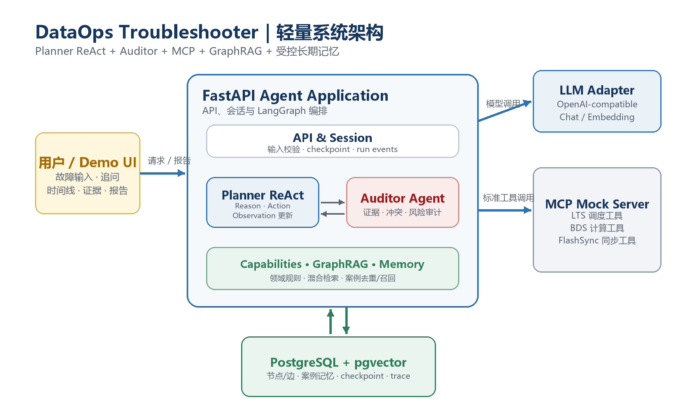
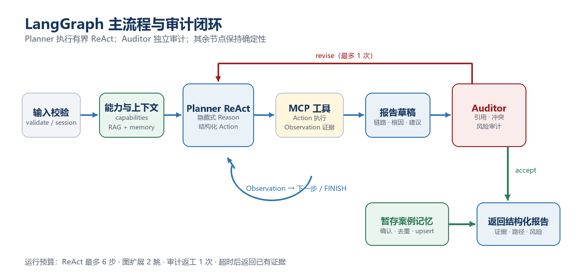

# DataOps Troubleshooter

## 大数据链路多 Agent 智能排障助手｜产品设计与开发规划 v2.0

**文档状态：** 开发基线  
**项目类型：** 个人求职作品集 / 脱敏业务原型  
**目标岗位：** AI Agent 应用开发、LLM 应用工程  
**更新日期：** 2026-07-10  
**核心技术：** LangGraph、ReAct、MCP、GraphRAG、长期记忆、FastAPI、PostgreSQL + pgvector

> [!LEAD]
> **一句话定位**：将大数据运维经验沉淀为一个证据驱动的智能排障 Agent。用户输入任务告警后，系统跨 LTS 调度、BDS 计算和 FlashSync 同步三个模拟组件收集证据，通过双 Agent 协作、GraphRAG 关系检索和长期案例记忆，输出可追溯、可审计的根因与处置建议。

### 本版核心决策

- 保留并真实实现 ReAct、GraphRAG、多 Agent 和长期记忆，四者均为核心能力，不作为可选增强项。
- Planner 必须通过有界 ReAct 循环完成“推理决策 → 工具行动 → 观察更新”，但不保存或展示模型原始思维链。
- “轻量化”通过控制业务场景、Agent 数量和基础设施实现，不再以 7 天或 1000 行代码作为硬约束。
- 核心产品只解决故障诊断与追问，不扩展为通用 DataOps 平台，不做自动修复和生产写操作。
- 所有效果数字先定义为验收目标；只有完成可复现评测后，才能作为实测结果写入 README 或简历。

---

# 1. 产品定义与边界

## 1.1 项目背景

典型大数据任务链路通常横跨调度、计算和同步系统。一个下游调度失败，表面上可能是 LTS 报错，真实根因却可能来自 BDS 上游计算延迟，甚至继续追溯到 FlashSync 数据同步异常。人工排障需要在多个系统间切换、阅读日志、核对依赖和回忆历史案例，过程长且高度依赖个人经验。

本项目来源于真实工作场景的抽象，但面向公开作品集重新设计：保留跨组件排障逻辑，使用合成任务、脱敏日志和 Mock 接口，不包含任何原单位生产数据、凭据、内部域名或未公开实现。

## 1.2 产品目标

1. 将跨组件排障 SOP 转化为可执行的 Agent 工作流，而不是只做知识问答。
2. 让结论建立在工具观察、知识节点、图路径和历史案例之上，并能逐条追溯。
3. 通过 ReAct 让 Planner 根据每轮 Observation 动态选择下一步工具或停止调查，而不是一次性生成静态答案。
4. 通过 Planner 与 Auditor 的职责分离，展示多 Agent 协作和抗幻觉设计。
5. 通过 GraphRAG 还原“同步异常 → 计算延迟 → 调度失败”等故障传导关系。
6. 通过长期记忆完成案例沉淀、去重和跨会话复用，形成可演示的学习闭环。
7. 形成结构清晰、可一键启动、可评测、可在面试中解释设计取舍的工程项目。

## 1.3 成功标准

- 用户提交一个脱敏告警后，系统能完成一次端到端诊断并返回结构化报告。
- Planner 至少能完成一次有效的 Action / Observation 循环，并在证据充分、需要用户补充信息或预算耗尽时正确停止。
- 报告中的关键结论均能关联 `evidence_id`，且可查看对应工具结果或图路径。
- Auditor 能拦截至少一类无依据结论、证据矛盾或高风险建议。
- 一个已确认案例能被写入长期记忆，并在后续相似问题中被召回。
- 跨组件 Golden Case 中，GraphRAG 检索结果实际包含并使用多跳关系，而非仅做向量相似匹配。
- 项目可通过 Docker Compose 或等价方式在干净环境启动，并提供稳定演示脚本。

## 1.4 非目标

| 不在核心范围内 | 边界说明 |
|---|---|
| 生产系统接入 | 首版只接入本地 MCP Mock 服务，不使用真实生产接口和数据。 |
| 自动修复 | 只给出建议、风险和回滚提示，不执行重跑、扩容、删表或修改配置。 |
| 通用 Agent 平台 | 固定大数据排障领域和双 Agent，不支持任意角色编排。 |
| 多租户与复杂权限 | 仅保留基础会话隔离和开发环境鉴权占位。 |
| 大规模知识工程 | 使用小规模人工整理的知识种子，不建设自动爬取、社区发现和复杂离线流水线。 |
| 完整前端产品 | 只提供满足演示的单页界面和 API，不建设后台管理平台。 |

# 2. 用户、场景与体验

## 2.1 目标用户

**主要用户：大数据运维工程师。** 用于告警后的跨系统排查、证据汇总和处置建议生成。

**次要用户：数据开发工程师。** 用于任务失败自查、依赖链定位和同类历史案例查询。

**作品集评审者：技术面试官或招聘方。** 关注系统是否真正使用多 Agent、MCP、GraphRAG 和记忆，以及工程边界、评测可信度和问题处理能力。

## 2.2 核心场景

### 场景 A：跨组件故障溯源（主演示场景）

用户输入：“LTS 任务 `dws_order_report_daily` 执行失败，请帮我定位根因。”

系统先查询 LTS 状态和日志，发现上游数据未就绪；再沿依赖查询 BDS 计算任务，发现源表读取延迟；随后查询 FlashSync，同步日志显示主键冲突。GraphRAG 补充三类现象之间的传导关系，Planner 形成根因假设，Auditor 校验证据后输出完整故障链路。

### 场景 B：单组件故障诊断

用户输入 BDS 任务运行缓慢。系统限定在 BDS 工具集内检查状态和资源指标，判断是资源不足、数据倾斜还是上游数据问题；没有证据时明确给出待补充项，不盲目跨组件扩散。

### 场景 C：多轮追问

用户在诊断后继续询问“怎么最快恢复”“这个操作风险高吗”。系统从短期会话状态读取已确认根因和证据，生成分步骤建议、前置检查和回滚提示，不重新执行无关排查。

### 场景 D：历史案例复用

用户提交与已处理故障相似的新告警。系统召回经过确认的长期案例，将其作为参考证据，同时优先使用本次实时工具观察，避免旧案例覆盖当前事实。

### 场景 E：全链路健康巡检（后续扩展）

批量检查多个核心任务和同步链路，生成健康度摘要。该场景复用现有工具和报告能力，但不进入首个完成闭环，避免分散核心诊断能力。

## 2.3 用户体验原则

- **先证据，后结论**：优先展示已查询内容和依据，再给出根因。
- **可见执行过程**：展示简短计划、结构化 Action、工具调用时间线和 Observation 摘要，不暴露模型原始思维链。
- **允许不确定**：证据不足时输出“当前无法确定”，并给出下一步最小检查项。
- **风险可感知**：每个处置建议包含风险等级、前置条件和回滚提示。
- **结果可复用**：排障结束后允许用户确认并保存为案例记忆。

# 3. 产品范围与功能设计

## 3.1 核心范围

| 优先级 | 能力 | 产品要求 | 验收方式 |
|---|---|---|---|
| P0 | 故障会话 | 创建会话、提交故障、支持基于上下文追问。 | 两轮以上对话不丢失任务与根因上下文。 |
| P0 | 双 Agent 编排 | Planner 负责调查与结论，Auditor 负责事实和风险审计。 | 可查看两角色的结构化输入输出和一次返工。 |
| P0 | Planner ReAct 闭环 | 每轮基于当前假设和 Observation 生成结构化 Action，执行工具后更新证据并继续或停止。 | 主演示场景至少包含一次有效循环；无无界循环和无理由重复调用。 |
| P0 | MCP 工具层 | 通过协议访问 LTS/BDS/FlashSync Mock 工具。 | Agent 不直接读取 Fixture；调用有 trace。 |
| P0 | GraphRAG | 向量种子召回、图扩展、路径评分和证据打包。 | 跨组件用例返回并引用 1–2 跳路径。 |
| P0 | 长期案例记忆 | 暂存、确认、去重、更新和跨会话召回。 | 相似案例可在下一会话命中。 |
| P0 | 历史案例匹配 capability | 推理阶段按需召回已确认的同类故障，输出相似点、差异点、参考方案和避坑提示。 | 命中案例带 ID、相似度和证据；不会覆盖本次实时 Observation。 |
| P0 | 审计与报告 | 引用检查、矛盾检查、风险分级、结构化报告。 | 无依据结论被拒绝或降级。 |
| P0 | 可复现评测 | Golden Cases、自动评测和消融对比。 | 一条命令生成带版本信息的评测结果。 |
| P1 | 单页演示 UI | 展示对话、执行时间线、图路径、证据和报告。 | 主演示场景无需 Postman 即可完成。 |
| P1 | 全链路巡检 | 批量读取多个任务并生成健康摘要。 | 不改变主诊断图和核心数据模型。 |

## 3.2 结构化排障报告

最终报告固定包含以下部分：

1. 故障摘要：对象、时间范围、当前状态和影响。
2. 故障传导链路：按上游到下游或根因到现象展示路径。
3. 根因结论：根因、置信度和仍存在的不确定性。
4. 证据清单：工具观察、知识节点、图路径和历史案例引用。
5. 修复建议：按执行顺序列出操作、前置条件和预期结果。
6. 风险与回滚：标记低/中/高风险，并说明回滚或验证方式。
7. 后续检查：证据不足或修复后需要继续验证的事项。
8. 相似案例：命中的已确认案例及差异点。

## 3.3 非功能要求

- **安全性**：工具只读，敏感配置来自环境变量，日志不记录密钥和完整用户隐私内容。
- **可复现性**：Mock 场景由 `scenario_id` 驱动，固定输入得到稳定工具结果。
- **可观测性**：每次运行生成 `run_id`，记录节点耗时、工具调用、检索路径、模型 token 和错误。
- **可替换性**：通过统一 LLM/Embedding 接口切换模型，不把供应商 SDK 传播到领域层。
- **性能目标**：演示模式下端到端 P95 不高于 30 秒；超时后返回已有证据和可继续操作。
- **成本约束**：限制 ReAct 最多 6 步工具行动、2 跳图扩展和 1 次审计返工，均可配置。

# 4. 系统架构



## 4.1 架构说明

**接入与展示层**：FastAPI 提供结构化 API；可挂载一个轻量单页 Demo，用于展示会话、事件时间线、GraphRAG 路径和最终报告。

**Agent 编排层**：LangGraph 维护状态机。Planner 采用有界 ReAct 行为范式，根据标准化 Observation 更新假设并选择下一项 Action；Auditor 独立完成事实与风险审计。只有 Planner 和 Auditor 是 LLM Agent，输入校验、检索、工具执行、Observation 记录、记忆写入和渲染均为确定性节点。

**工具层**：独立本地 MCP Mock 服务暴露 LTS、BDS 和 FlashSync 只读工具，使用合成 Fixture 提供稳定场景和失败注入。

**知识与记忆层**：PostgreSQL + pgvector 同时保存知识节点、关系边、向量、历史案例、会话检查点和运行事件。使用关系表与递归查询/应用层遍历实现轻量 GraphRAG，不额外引入图数据库。

**模型层**：使用 OpenAI-compatible Chat Model 适配器；Embedding 默认可选本地中文模型或兼容 API，具体供应商由环境配置决定。

## 4.2 技术选型

| 层级 | 建议技术 | 选择理由 |
|---|---|---|
| API / Demo | FastAPI + 可选 Gradio 挂载 | API 优先，单进程即可提供可视化演示。 |
| Agent 行为范式 | ReAct + Pydantic 结构化决策 | 将推理决策、工具行动和观察更新形成可测试闭环，避免自由文本驱动工具。 |
| 编排 | LangGraph | 适合有状态循环、条件分支、返工和 checkpoint。 |
| 工具协议 | MCP Python SDK / FastMCP | 展示标准化工具边界，便于独立测试和替换。 |
| 数据库 | PostgreSQL 16 + pgvector | 一套基础设施承载状态、向量、图关系和案例。 |
| ORM / Schema | SQLAlchemy 2.x + Pydantic 2.x | 明确持久化与领域边界，支持类型校验。 |
| 模型接入 | OpenAI-compatible adapter | 兼容 GPT、Qwen、DeepSeek 等调用形态。 |
| 测试 | pytest + pytest-asyncio | 覆盖节点、工具、检索、记忆和端到端场景。 |
| 交付 | Docker Compose | 启动 API、MCP Mock 和 PostgreSQL 三个服务。 |

## 4.3 推荐代码结构

```text
app/
  api/                 # FastAPI 入口、路由、依赖和响应模型
    main.py
  agents/              # Planner ReAct、Auditor 节点与版本化 Prompt
    planner.py
    auditor.py
  capabilities/        # 运行时领域能力配置，不是 Codex Skill
    base.py
    registry.py
    troubleshooting.py # 单组件诊断、跨组件链路溯源
    history.py         # 历史案例匹配与差异分析
    reporting.py       # 风险评估、结构化报告约束
  orchestration/       # LangGraph 状态、有界 ReAct 循环和工作流
    state.py
    react_loop.py
    workflow.py
  mcp/                 # MCP 客户端、工具白名单与 Observation 适配
  retrieval/           # vector / graph / hybrid 检索
  memory/              # short_term / long_term 记忆服务
  domain/              # Evidence、Hypothesis、Action、Report 等模型
  persistence/         # SQLAlchemy 模型、仓储和迁移
  core/                # settings、依赖注入和公共配置
  observability/       # 结构化日志、事件和运行指标
mcp_server/
  tools/               # LTS / BDS / FlashSync Mock MCP 工具
data/
  fixtures/            # 合成工具返回和异常场景
  knowledge/           # 脱敏知识种子、SOP 和案例
tests/
  unit/
  integration/
  evals/
pyproject.toml
README.md
```

`app/capabilities/` 借鉴参考方案中的 Agent Skill Library，但只承载可复用的领域约束、Prompt 片段、工具优先级和输出校验，不自行创建 LLM Agent。首版固定五类能力：单组件诊断、跨组件链路溯源、历史案例匹配、风险评估和结构化报告；由路由/Planner 按需选择并组合，避免建设通用动态插件框架。仓库级开发 Skill 仍位于 `.agents/skills/`，两者不要混用。

# 5. 多 Agent 编排设计

## 5.1 角色职责

| 角色/节点 | 类型 | 核心职责 | 明确边界 |
|---|---|---|---|
| Planner ReAct Agent | LLM Agent | 拆解问题、维护假设，按 Reason → Action → Observation 循环选择工具、更新证据并生成草稿。 | 不负责最终放行；不得调用白名单外工具；不得输出或持久化原始思维链。 |
| Auditor Agent | LLM Agent | 校验事实支撑、引用一致性、冲突、风险和报告完整性。 | 不新增事实、不直接修改数据库、不无限返工。 |
| Router / Retriever / Tool Executor | 确定性节点 | 输入规范化、上下文检索、MCP 调用和结果标准化。 | 不包装成额外 Agent。 |
| Memory Writer / Renderer | 确定性节点 | 暂存案例候选、去重、确认写入和响应渲染。 | 未通过审计不得写入长期记忆。 |

## 5.2 Planner ReAct 契约

Planner 的每轮行为固定为以下三部分：

1. **Reason**：模型在内部判断当前假设、证据缺口和下一步价值；对外只返回简短 `decision_summary`、假设更新和缺失证据，不返回逐步思维链。
2. **Action**：返回一个结构化决策：调用白名单 MCP 工具、结束调查或请求用户补充信息。工具名和参数必须通过 Pydantic 校验。
3. **Observation**：确定性工具节点执行 Action，将成功、空结果、超时或错误统一转换为 `Evidence` 和 `ToolEvent`，再写回状态供下一轮使用。

结构化决策至少包含：`status`（`call_tool` / `finish` / `need_user_input`）、`decision_summary`、`hypothesis_updates`、`action`、`evidence_refs` 和 `stop_reason`。不得要求模型生成工具的 Observation，也不得在状态、日志或 API 中保存完整 `Thought` 文本。

ReAct 循环默认最多 6 步，并满足以下停止条件之一：证据已支持可审计结论、需要用户补充关键参数、继续调用预期信息增益过低、工具预算或总超时耗尽。除上一次调用为可重试的瞬时错误外，不得使用相同参数重复调用同一工具。

可执行的 Planner Prompt 模板、输出 Schema 和运行时防护见 `docs/prompt-contracts.md`。Prompt 必须版本化并纳入 Golden Case 回归，不得把自由文本 `Thought / Action` 解析作为生产工具调用接口。

## 5.3 状态流转



主流程为：校验输入 → 读取会话 → GraphRAG/案例检索 → Planner ReAct 决策 → MCP Action 执行 → Observation 标准化 → Planner 更新假设并继续或停止 → 生成草稿 → Auditor 审计 → 最多一次返工 → 暂存案例记忆 → 返回报告。

Planner 每轮只输出结构化决策：当前假设变化、下一项 Action、参数、预期证据和停止原因。工具执行节点负责真正调用 MCP 并将 Observation 转换为 `Evidence`。当证据充分、达到调用预算或继续调用无价值时，Planner 结束调查。

## 5.4 审计规则

- 每项根因、故障链路边和高风险建议必须至少关联一个有效证据。
- 证据内容与结论语义不一致时，标记 `unsupported_claim`。
- 实时工具结果与历史案例冲突时，以本次工具观察为优先，并在报告中说明差异。
- 高风险操作缺少前置检查或回滚提示时，不允许通过。
- 证据不足时允许输出低置信度或无法判断，不为追求完整报告而编造事实。
- 首版最多返工一次；二次仍不通过时，返回降级报告和缺失证据清单。

## 5.5 核心状态字段

`AgentState` 至少包含：`run_id`、`session_id`、`user_query`、`intent`、`active_capabilities`、`plan`、`hypotheses`、`evidence`、`tool_events`、`retrieved_paths`、`react_step`、`next_action`、`observation_refs`、`stop_reason`、`draft_report`、`audit_result`、`retry_count` 和 `memory_candidate`。状态中不得包含原始 `reasoning_process` 或完整 `Thought`。

所有跨节点数据使用 Pydantic 模型传递；工具异常、空结果和超时也必须进入状态，不能仅写日志后吞掉。

# 6. MCP 工具层设计

## 6.1 最小工具集

| 组件 | 工具 | 主要输出 |
|---|---|---|
| LTS | `lts.get_task_status` | 任务执行状态、触发时间、重试次数和上游就绪情况。 |
| LTS | `lts.get_task_log` | 脱敏执行日志、错误码和报错堆栈摘要。 |
| LTS | `lts.get_dependency_topology` | 任务上下游依赖、数据集和链路状态。 |
| BDS | `bds.get_task_status` | 计算任务运行状态、阶段、资源占用和持续时间。 |
| BDS | `bds.get_task_log` | 执行日志、报错信息、性能指标和数据倾斜线索。 |
| BDS | `bds.get_table_info` | 表结构、数据量、分区、更新时间和必要的统计信息。 |
| FlashSync | `flashsync.get_sync_delay` | 单表同步延迟、吞吐量、位点和积压情况。 |
| FlashSync | `flashsync.get_sync_log` | 同步异常日志、错误类型和冲突对象。 |
| FlashSync | `flashsync.check_consistency` | 源端与目标端的数据一致性抽检结果及差异摘要。 |

## 6.2 统一契约

```json
{
  "request": {
    "resource_id": "dws_order_report_daily",
    "time_range": {"start": "...", "end": "..."},
    "scenario_id": "cross_chain_pk_conflict",
    "trace_id": "run_xxx"
  },
  "response": {
    "ok": true,
    "data": {},
    "evidence": [{"source_id": "...", "content": "..."}],
    "error_code": null,
    "error_message": null,
    "observed_at": "..."
  }
}
```

Mock 服务必须支持正常、空结果、超时、权限拒绝和服务异常。工具调用需要超时、重试上限和错误分类；Planner 看到的是标准化 Observation，不直接依赖各组件原始字段。工具失败后仅在瞬时错误且预算允许时重试一次；仍失败时可引用知识库给出低置信度参考，但不得将其包装成已由实时工具确认的根因。

# 7. GraphRAG 设计

## 7.1 模块定位

传统向量检索擅长找到“相似文本”，但不天然知道故障如何跨组件传播。GraphRAG 在本项目中承担两项职责：找到与当前现象相关的知识种子；沿显式关系恢复可能的故障链路并向 Agent 提供可引用路径。

## 7.2 图数据模型

| 类别 | 类型 | 示例 |
|---|---|---|
| 节点 | `component` | LTS、BDS、FlashSync。 |
| 节点 | `task` / `dataset` | 调度任务、计算作业、源表和目标表。 |
| 节点 | `symptom` | 任务失败、上游未就绪、同步延迟。 |
| 节点 | `root_cause` | 主键冲突、资源不足、依赖缺失。 |
| 节点 | `solution` / `sop` | 清理冲突、调整资源、补齐依赖。 |
| 节点 | `case` | 已确认的历史故障案例。 |
| 关系 | `DEPENDS_ON` / `CONSUMES` / `PRODUCES` | 任务和数据之间的上下游关系。 |
| 关系 | `MANIFESTS_AS` / `CAUSED_BY` / `RESOLVED_BY` | 现象、根因和方案之间的知识关系。 |
| 关系 | `SIMILAR_TO` | 历史案例之间的相似关系。 |

## 7.3 检索流程

1. 将用户描述、当前假设和关键工具观察组合为检索查询。
2. 使用 pgvector 语义检索与 PostgreSQL 全文检索分别召回种子节点，保留相似度、关键词命中和来源。
3. 合并、规范化并去重两路种子，再沿关系白名单扩展 1–2 跳，优先 `DEPENDS_ON`、`CAUSED_BY`、`MANIFESTS_AS` 和 `RESOLVED_BY`。
4. 使用可配置混合评分，例如：语义相似度 0.45、全文命中 0.10、路径相关性 0.25、证据可靠性 0.10、案例新鲜度 0.10。
5. 将节点、边、完整路径、分数和来源组装为 `evidence_bundle`，供 Planner 和 Auditor 使用，并将最终注入上下文控制在必要范围内。

首版知识库采用人工整理的脱敏 JSON/YAML：建议包含 20–30 个典型案例、10 个左右 SOP 和必要的组件/任务关系。允许使用 `docs/prompt-contracts.md` 中的 GraphRAG 实体与关系抽取 Prompt 辅助生成待审核候选，但每个实体和关系必须携带原文 `source_span`，通过 Schema、去重和人工/规则复核后才能入库。暂不建设在线自动实体抽取、社区发现和大规模索引流水线。

## 7.4 GraphRAG 验收

- 至少一个跨组件用例返回包含三个组件的关系路径。
- Planner 的故障链路引用具体 `path_id`，而不是只引用相似文档。
- 删除关键边后，相应用例的链路完整性下降，证明图关系真正参与推理。
- 评测中对比 vector-only 与 vector+graph，记录根因命中和链路完整性差异。

# 8. 记忆系统设计

## 8.1 记忆分层

| 层级 | 生命周期 | 内容 | 实现 |
|---|---|---|---|
| 短期会话记忆 | 单个会话 | 用户问题、工具事件、假设、报告和追问上下文。 | LangGraph checkpoint 或会话仓储。 |
| 长期案例记忆 | 跨会话 | 已确认症状、根因、故障路径、方案、证据和标签。 | PostgreSQL + pgvector `case_memories`。 |

## 8.2 写入流程

1. Auditor 通过后，由确定性节点从最终报告生成结构化案例候选。
2. 将候选标记为 `pending`，默认等待用户确认；Golden Case 可通过测试配置自动确认。
3. 使用组件/根因签名和向量相似度执行去重。
4. 命中重复案例时更新出现次数、最近时间和新增证据；未命中时插入新案例。
5. 将已确认案例同时注册为 GraphRAG 的 `case` 节点，并建立相关关系。

## 8.3 使用规则

- 长期记忆只作为参考，实时工具观察的优先级更高。
- 未确认案例不得参与默认召回。
- 记忆引用必须携带案例 ID、确认状态、时间和相似度。
- 支持删除或取消确认，便于修正错误记忆。
- 不保存模型原始思维链，只保存结构化事实、结论和证据引用。

## 8.4 历史案例匹配 capability

历史案例匹配在以下情况按需触发：用户明确询问同类故障；Planner 需要验证当前假设是否有已确认先例；现有工具证据指向一个可复用的症状/根因签名。它不是每轮 ReAct 都强制执行的固定步骤。

输入至少包含当前组件、症状、候选根因、故障路径和关键 Observation；检索结合向量相似度、标签/组件过滤和 `SIMILAR_TO` 关系。输出包含案例 ID、相似度、共同点、差异点、历史处理方案、避坑提示和引用证据。

只有 `confirmed` 案例可进入默认匹配。历史方案仅用于补充参考和风险提示；当历史案例与本次实时 Observation 冲突时，必须突出差异并以本次工具证据为准。

# 9. API 与数据契约

## 9.1 API 设计

| 方法与路径 | 用途 |
|---|---|
| `POST /api/v1/sessions` | 创建排障会话。 |
| `POST /api/v1/sessions/{session_id}/messages` | 提交故障或追问，返回 `run_id`。 |
| `GET /api/v1/runs/{run_id}` | 获取当前状态和最终结构化报告。 |
| `GET /api/v1/runs/{run_id}/events` | 获取节点、ReAct Action / Observation、检索和审计事件时间线。 |
| `POST /api/v1/memories/{memory_id}/confirm` | 确认或拒绝案例记忆。 |
| `GET /api/v1/memories/search` | 查询相似的已确认案例。 |
| `GET /health` | 检查 API、数据库、MCP 和模型连接。 |

首版可使用轮询读取运行状态；只有确实改善演示体验时再增加 SSE，不把实时流式作为核心依赖。

## 9.2 关键数据表

| 表 | 主要字段与用途 |
|---|---|
| `diagnosis_sessions` | 会话标识、用户输入摘要、创建和更新时间。 |
| `agent_runs` / `run_events` | 节点状态、耗时、模型使用、工具和错误轨迹。 |
| `knowledge_nodes` | 节点类型、内容、embedding、来源和可靠性。 |
| `knowledge_edges` | 起点、终点、关系类型、权重和来源。 |
| `case_memories` | 结构化案例、确认状态、向量、出现次数和时间。 |
| `memory_evidence` | 案例与证据之间的可追溯关联。 |

# 10. 评测与质量体系

## 10.1 Golden Cases

构建 28 个脱敏且可复现的测试用例：8 个单组件故障、10 个跨组件故障、4 个模糊或证据不足问题、3 个工具异常/证据冲突场景、3 个长期记忆召回场景。

每个用例标注：预期意图、必要工具、允许的根因集合、必要故障路径、关键证据、风险等级和安全降级行为。评测集进入版本控制，任何提示词、模型或检索变更都能重复运行。

## 10.2 初始验收目标

| 指标 | 目标值 | 说明 |
|---|---|---|
| 意图/场景识别准确率 | ≥ 90% | 在 28 个 Golden Cases 上计算。 |
| 根因 Top-1 命中率 | ≥ 80% | 允许预先定义的等价根因表达。 |
| 跨组件链路完整率 | ≥ 85% | 必要节点与边均被识别。 |
| 关键结论引用完整率 | 100% | 根因、链路和高风险建议必须有引用。 |
| 无依据结论率 | ≤ 5% | 由规则和人工抽查联合判断。 |
| MCP 调用成功率 | ≥ 95% | 不含故意注入的异常场景。 |
| 必要 Action 覆盖率 | ≥ 90% | Golden Case 预先标注的必要工具行动至少被执行一次。 |
| 无效或重复 Action 率 | ≤ 10% | 无信息增益或同参重复调用占全部工具行动的比例。 |
| 记忆去重正确率 | ≥ 90% | 重复与新案例均纳入测试。 |
| 端到端 P95 | ≤ 30 秒 | 固定演示配置下测量。 |

以上均为目标值，不是当前成绩。交付时同时保存模型、提示词、数据集和代码版本；只有实际跑出的结果才能写入项目宣传材料。

## 10.3 测试分层

- **单元测试**：ReAct 决策解析、停止条件、重复 Action 拦截、工具结果适配、图扩展、混合评分、证据校验、记忆去重和风险规则。
- **集成测试**：FastAPI → LangGraph ReAct 循环 → MCP → PostgreSQL 的最小闭环，并覆盖超时、空结果和预算耗尽。
- **端到端测试**：以主演示场景验证双 Agent、GraphRAG 路径、审计和记忆写入。
- **消融测试**：比较 vector-only / vector+graph、Auditor off/on、Memory off/on。
- **人工抽查**：检查证据是否真正支持结论、建议是否可执行，以及报告是否过度自信。

# 11. 开发里程碑

不按固定天数压缩开发，以可验证的里程碑作为推进依据。每个里程碑只在退出条件满足后进入下一阶段。

| 里程碑 | 主要交付 | 退出条件 |
|---|---|---|
| M0：契约与数据基线 | 项目骨架、领域模型、Prompt 契约、Docker Compose、3–5 个合成场景、Golden Case 格式。 | 干净环境可启动；Fixture 可独立测试；Prompt 输出通过 Schema 校验。 |
| M1：ReAct 双 Agent 工具闭环 | FastAPI 会话、LangGraph、Planner ReAct、Auditor、MCP 客户端与最小工具集。 | 单组件和跨组件各 1 个用例端到端通过；Action / Observation 可追踪；Auditor 能触发一次返工。 |
| M2：GraphRAG | 节点/边表、向量与全文双路种子召回、1–2 跳扩展、路径证据和消融测试。 | 主演示场景引用真实多跳路径；hybrid+graph 对链路完整性有可解释增益。 |
| M3：长期记忆 | 会话 checkpoint、案例候选、确认、去重、更新、召回与 GraphRAG 融合。 | 已确认案例可在下一会话命中；错误候选不会污染默认召回。 |
| M4：评测与演示 | 28 个 Golden Cases、自动评测、单页 Demo、README、架构图和演示脚本。 | 一条命令完成启动和评测；结果可复现；无真实数据和密钥。 |

## 11.1 每个切片的完成定义

每次 vibe coding 只交付一个可验证垂直切片：先定义用户可见结果和 2–5 条验收条件，再贯通 API、ReAct 决策、Action 执行、Observation 回写、检索/记忆与持久化，最后补齐单元和集成测试。避免一次性生成大量互不连通的文件或抽象层。

# 12. 风险与控制

| 风险 | 可能表现 | 控制措施 |
|---|---|---|
| 范围膨胀 | Agent 数量增加、引入多套数据库和无关场景。 | 固定双 Agent、一个主流程、PostgreSQL 单存储和明确非目标。 |
| ReAct 循环失控 | 重复调用工具、无信息增益仍继续、超时或 token 成本失控。 | 最大步数、同参去重、工具白名单、总超时、停止原因和预算耗尽降级。 |
| “伪 GraphRAG” | 只有向量检索，图关系未参与答案。 | 返回 `path_id`，做删边验证和 vector-only 消融。 |
| 记忆污染 | 错误结论自动写入并影响后续回答。 | 审计通过、候选暂存、用户确认、去重和可撤销。 |
| 幻觉与过度自信 | 无证据根因、虚构日志、危险建议。 | Evidence ID、Auditor、工具白名单、置信度和安全降级。 |
| 指标失真 | 直接沿用未实测的提升百分比。 | 区分目标值与实测值，保存评测版本和原始结果。 |
| 工作经历泄密 | 真实任务、日志、接口或内部名被公开。 | 合成 Fixture、脱敏命名、仓库扫描和公开前人工复核。 |
| 模型锁定 | 业务代码依赖单一供应商。 | 统一 Chat/Embedding 适配器，配置化模型和超时。 |

# 13. 作品集交付与演示

## 13.1 仓库交付物

- 清晰的 README：问题背景、架构、快速启动、演示场景、评测结果和限制。
- `.env.example`、数据库迁移、Docker Compose 和合成数据初始化脚本。
- 产品设计文档、架构图、核心状态图和 API 示例。
- 版本化的 Planner ReAct 与 GraphRAG 抽取 Prompt 契约及其 Schema 测试。
- 单元、集成、端到端和评测用例。
- 一份由脚本生成的评测报告，明确模型、数据和代码版本。
- 可选的演示 GIF/视频，不替代可运行代码。

## 13.2 建议演示路径

1. 一键启动 API、MCP Mock 和 PostgreSQL。
2. 提交跨组件主演示故障，展示 Planner ReAct 的短计划、Action / Observation 时间线和停止原因。
3. 展示 GraphRAG 的多跳路径与每项结论的证据引用。
4. 展示 Auditor 拦截或修正一个缺少依据的结论。
5. 确认保存案例，再提交相似故障展示长期记忆召回。
6. 打开评测报告，说明 vector-only 与 vector+graph、Auditor off/on 的差异。

## 13.3 简历表述原则

优先描述已实现的工程机制和实测结果，例如：“设计并实现基于 LangGraph 的 Planner ReAct / Auditor 双 Agent 排障流程，使用 MCP Mock 工具、pgvector GraphRAG 和受控长期记忆，在 28 条脱敏用例上实现根因 Top-1 **[实测值]**、关键结论引用完整率 **[实测值]**。”

在评测完成前保留占位或只描述设计，不填写推测数字。

# 14. 最终验收清单

- [ ] 双 Agent 均有独立提示词、结构化输入输出和可观察运行节点。
- [ ] Planner 通过有界 ReAct 循环完成 Action / Observation 闭环，能正确停止且不保存或展示原始思维链。
- [ ] Planner ReAct 与 GraphRAG 实体/关系抽取 Prompt 已版本化，结构化输出和失败路径有测试。
- [ ] 9 个 LTS/BDS/FlashSync 只读工具均通过真实 MCP 协议暴露，可独立测试并留下 trace。
- [ ] GraphRAG 返回节点、关系、路径和分数，且主用例实际引用图路径。
- [ ] Auditor 能检测无依据结论、证据冲突和缺少风险提示的建议。
- [ ] 长期记忆支持候选、确认、去重、更新、召回和撤销。
- [ ] 历史案例匹配 capability 能按需返回共同点、差异点、参考方案和避坑提示，且不会覆盖实时证据。
- [ ] API 返回结构化报告，Demo 展示证据和时间线，不展示原始思维链。
- [ ] 28 个 Golden Cases 可重复运行，目标值与实测值明确区分。
- [ ] Docker Compose 可从干净环境启动，核心失败场景有测试。
- [ ] 仓库不包含真实生产数据、凭据、内部域名或不可公开信息。
- [ ] README、产品文档、代码和演示口径一致，未实现能力不被描述为已完成。

> [!NOTE]
> **最终产品边界**：这是一个聚焦大数据任务链路故障诊断的轻量 Agent 应用。它以 ReAct、双 Agent、MCP、GraphRAG 和长期记忆构成完整技术闭环，以证据、审计和可复现评测建立可信度；它不追求覆盖所有运维场景，也不承担生产自动化平台职责。
